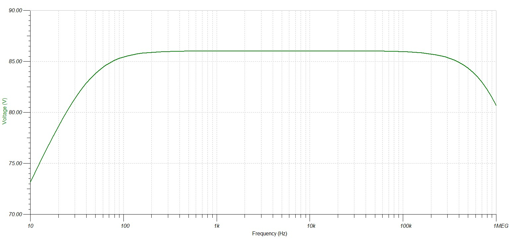
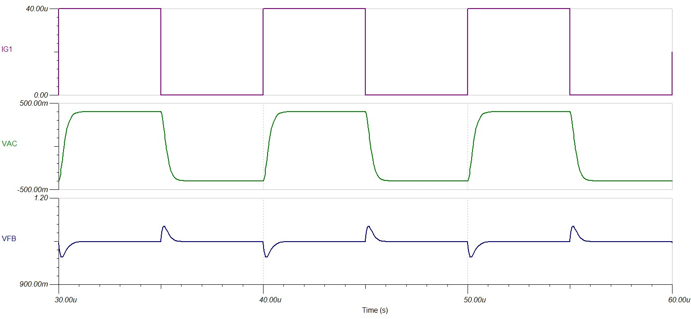

# BETTER CIRCUIT DESIGN
## Changelog
I've done some modifications to my amplifier design, such that:
- Dark current error is mitigated
- Output signal is free from Common Mode offset (VCM) and input voltage offset (VOS)

### Dark current error
The errors caused by dark current are mitigated by getting rid of the accidental reverse bias present in the earlier iteration, where VCM >> VBIAS. In the zero-bias mode, the photodiode will have no (very very small) dark current, with increased sensibility being an additional advantage.
For the photodiode to work in the zero-bias mode, we must set the bias voltage of the diode's anode to the same value as our virtual ground and/or dc offset.
### DC offset errors
To remove the static errors associated with the design of this particular circuit, we must filter the ouput and remove all forms of DC offset, either in the form of VCM, or as a result of the presence of input offset voltage. At DC and very low frequencies, the capacitive elements present in a transimpedance amplifier circuit are to be ignored (very high impedance) and the circuit analysis somewhat simplifies. The noise gain (NG) of the circuit is $1+\frac{R_{F}}{R_{I}}$, where RF is the transimpedance gain resistor and RI is the resistance seen at the input of the op-amp.
RI will be huge, and we may approximate the noise gain to $\approx 1$.

The removal of the DC component can be done with the help of a low pass filter, either an active or pasive one. Given the time, complexity and space constraints, I have implemented a simple passive RC low-pass filter (LPF). The filter succesfully removes most of the DC component and does not load the circuit too much.

### Final circuit schematic
The final circuit schematic of the TIA includes all power supply filtering, output filtering components and VCM-setting components necessary for making this circuit work at its best. VCM is important, because the overall open loop gain (AOL) of the circuit may depend on the voltage level of VCM.

This is the circuit:

 
  

    
     
     
    <a><b>Final iteration of the Photodiode Transimpedance amplifier</b></a>

 

And here are some simulations to showcase the performance of the TIA:

 
  

    
     
     
    <a><b>Transimpedance Gain of circuit</b></a>

 

 
  

    
     
     
    <a><b>100KHz transient response</b></a>

 

## Conclusions
The circuit I build achieves:
- constant transimpedance gain up to 100KHz and more
- high degree of stability
- great balance between speed (tr) and overshoot percentage (PO) for any given waveform
- minimal current consumption: low power op-amp with no current-hogging voltage reference for setting the DC offset

The circuit can be powered by simple batteries and will last some time. I am satisfied with the design process, will build out the circuits when needed components arrive.

https://www.thorlabs.com/catalogpages/Obsolete/2018/DET36A_M.pdf
https://www.thorlabs.com/newgrouppage9.cfm?objectgroup_id=9817
https://pages.olin.edu/files/isim/files/m15.lab_.oximeter.pdf
https://hackaday.io/project/18138-bullet-movies/log/49033-biased-photodetector-sensor
https://electronics.stackexchange.com/questions/695059/how-to-estimate-the-optical-power-given-the-scope-reading-for-this-scenario
https://electronics.stackexchange.com/questions/595250/what-is-the-role-of-capacitor-of-avalanche-photodiode-circuit
https://www.farnell.com/datasheets/3171157.pdf
https://www.instructables.com/How-to-Program-an-Attiny85-From-an-Arduino-Uno/
https://electronics.stackexchange.com/questions/109115/why-when-calculating-rise-time-do-we-use-2-2-%CF%84-rc-low-pass-circuit
