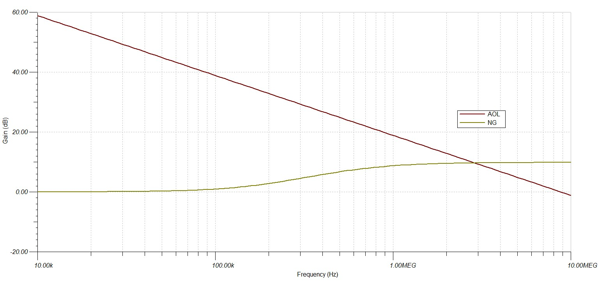

# INTRODUCTION
This document covers the proper method of selecting compensation capacitors for the implementation of functional Photodiode Transimpedance Amplifiers.
## A short note on compensation
The basic circuit of a transimpedance amplifier is centered around an operational amplifier, with a feedback network consisting of a singular high-valued, high precision resistor. This circuit, however, suffers from stability issues related to the inherent capacitance of the photodiode. Together with the feedback resistor, this input capacitance forms a zero in the transfer function of the Noise Gain. If left uncompensated, the Rate of Closure at the intersection between the Noie Gain and the Loop Gain will be 40dB / decade, ensuring ony a marginal stability.

To achieve better performance, compensation is mandatory. A feedback capacitor is added across the gain resistor, thereby introducing a pole in the Noise Gain transfer function. This pole cancels out the 20dB/dec rise of the Noise Gain, introducing a stable plateau of 0dB/dec. As such, at the 
gain-crossing frequency, the ROC resolves to 20dB / decade, proper stability is achieved.

## Considerations
There are fout main considerations when building out the compensated TIA pictured in this doc. :
- Bandwidth: Feedback Capacitor CF degrades the bandwidth of the TIA
- Op-amp GBP: High-bandwidth TIA's neccessitate op-amp with large GBPs
- Stray Capacitances: Any stray capacitance across the gain resitor alters the transfer function of the circuit
- Q-factor: system's Q-factor influences Bandwidth and transient response

## Theory
The compensated TIA's transfer function is that of a second-order Low-pass filter, of the form $T(s) = \frac{A_{DC}\cdot \omega_{0}^{2}}{s^{2}+\frac{\omega_{0}}{Q}\cdot s + \omega_{0}^{2}}$, where $w_{0}$ is the natural frequency and the ratio $\frac{\omega_{0}}{Q}$ is equal to $2\cdot\zeta\cdot\omega_{0}$
and is called the Bandwidth. 

This circuit presents two poles, one at $f_{p1}=\frac{1}{2\pi\cdot R_{F}C_{F}}$ and one at $f_{p2}=\frac{GBP\cdot C_{F}}{2\pi\cdot(C_{I}+C_{F})}$. The first pole acts as the dominant pole of the system, having the greater impact on limiting the Bandwidth of the circuit. $C_{I}$ is the total
input capacitance (photodiode capacitance and parasitic op-amp input capacitance), while $C_{F}$ is the chosen value of the compensation capacitor.

Of great importance to our design workflow, the Q-factor has several values of great interest to us. Any second order system can be underdamped, overdamped or criticaly damped. Q-factor has great impact on rise-time ($t_{r}$) and overshoot ($PO$). We would like to have a signal with no overshoot
and no rise-time. This is, however, impossible, a compromise is desirable. 

-  Underdamped systems have short rise-times, but large overshoots and settling times
-  Overdamped systems have small overshoots, but long rise-times
-  Critically damped systems have short rise-times and no overshoots

A system is considered critically damped if the Q-factor is 0.5 (or $\zeta$ = 0.5).

Other useful Q-factors are Q = 1 and Q = $\frac{\sqrt{2}}{2}$, with the second one being the Q-factor for which the transfer function attains a maximally flat frequency response.

## Design Process
Given the known variables and constraints:
- $C_{I}$
- $A_{DC}$
- $GBP$
- desired BW

We must find the values of the following critical parameters:
- $C_{Fmax}\quad$: the maximum feedback capacitance such that the Bandwidth of the TIA is preserved
- $C_{Fmin}\quad$: the minimum feedback capacitance such that the ROC is at most 20dB/decade
- $Q_{min}\quad$: the minimum Q-factor attainable
   
$$C_{Fmax}=\frac{1}{2\pi\cdot R_{F}\\,BW}$$

$$C_{Fmin}=\frac{1}{4\pi\cdot R_{F}\\,GBP}\cdot\(1+\sqrt{1+8\pi\cdot R_{F}\\,GBP\\,C_{I}}\)$$

Any feedback capacitance value in the range $\[C_{Fmin},\quad C_{Fmax}\]$ will ensure stability and acceptable overshoot percentages/ rise-times. For CF = $C_{Fmin}$, the Q-factor will be 1. For any other value of used CF, we can determine the Q-factor with the formula:

$$ Q_{m}=\frac{1}{C_{F}}\cdot\sqrt{\frac{C_{I}+C_{F}}{2\cdot\pi\cdot R_{F}\cdot GBP}} $$

If we select $C_{Fmax}$ we can derive $Q_{min}$, the smallest Q-factor achievable, whilst preserving the TIA's Bandwidth (BW).

If $Q_{min}\leq 0.5$ we can find the optimal value of CF, such that the system is critically damped, with the following formula:

$$C_{F}=\frac{1+\sqrt{1+8\cdot\pi\cdot Q^{2}\cdot GBP\cdot R_{F}\cdot C_{I}}}{4\cdot\pi\cdot Q^{2}\cdot GBP\cdot R_{F}}$$

The formula from above is valid for all possible Q's.
## A few additional notes after some careful tinkering
This approach is best suited for TIAs with prospective bandwidths limited to 1MHz, or less. CFopt may, in some cases, be larger than CFmax, but that does not necessarily imply a reduction in bandwidth.

With decreasing Q comes a decrease in Bandwidth and an increase in stability and phase margin. GBP also contributes to the size of the feedback capacitor, as the feedback capacitance is inversely proportional to the operational amplifier's GBP. A more useful and general method is to simply iterate all possible Q's and check for stability and feedback capacitance value. In general, a TIA with a feedback capacitance below 50fF will be impossible to realize, I would want to limit myself to a multiple of 0.5pF (and that only with very careful layout).  RF and Cin also have a great impact on CF and Bandwidth. 

You can find the proper, general implementation of a general purpose TIA Design calculator <a href="">here</a>.
## Actual TIA implementation
We have the following requirements:

| Parameter           | Value  | Unit    |
|---------------------|--------|---------|
| $f_{max}$           | 100    | kHz     |
| $BW$                | 300    | kHz     |
| $I_{SC}$ @ 1mW/cm^2 | 50     | $\mu A$ |
| $V_{O(max)}$        | 1      | V       |
| $C_{D}$ @ VR = 0V   | 15     | pF      |

The parameters have the following meanings:
-  $f_{max}$ is the maximum frequency where the waveform should have no significant distortion
-   $I_{SC}$ is the shortcircuit current of the photodiode QSD2030F from ONSEMI
-   $V_{O(max)}$ is the maximum output voltage swing
-   $C_{D}$ is the photodiode capacitance

For the TIA I selected the OPA2374 from Texas Instruments for its:
- pA-range bias/offset currents
- availability on the local market
- High GBP

Otherwise, this are the most important parameters of the op-amp I selected:

| Parameter      | Value   | Unit |
|----------------|---------|------|
| GBP            | 6.5     | MHz  |
| $A_{OL}$      | 110     | dB   |
| $I_{B}/I_{OS}$ | $\pm$ 10| pA   |
| $V_{OS}$       | 5       | mV   |
| $C_{DIFF}$     | 3       | pF   |
| $C_{CM}$       | 6       | pF   |

Selection of CF and performance verification are done with the help of a short python script:

```python
import numpy as np
import matplotlib.pyplot as plt

#OP-AMP SPECS

GBP = 6.5e+6
ADC = 10 ** (110/20)
SR = 5e+6
BW = 0.3e+6
Isc = 50e-6
VOmax = 1
CT = 25e-12

#Gain resistor selection
RF = VOmax / Isc
print(RF/1e+3,'kOhm')

#Minimum feedback capacitance to ensure stability
Q = 1
CFmin = (1 + np.sqrt(1 + 8 * Q **2 * np.pi * GBP * RF * CT)) / (4 * Q ** 2 * np.pi * GBP * RF)
print(np.round(CFmin/1e-12,2), "pF")

#Maximum feedback capacitance to ensure Bandwidth preservation
CFmax = 1 / (2 * np.pi * RF * BW )
print(np.round(CFmax/1e-12,2), "pF")

#Optimal feedback capacitance, for Q = 0.5
Q = 0.5
CFopt = (1 + np.sqrt(1 + 8 * Q **2 * np.pi * GBP * RF * CT)) / (4 * Q ** 2 * np.pi * GBP * RF)
print(np.round(CFopt/1e-12,2), "pF")

#Minimum Q-factor achievable
Qmin = 1 / CFmax * np.sqrt((CT + CFmax)/(2 * np.pi * RF * GBP))
print(np.round(Qmin,2))

#Full power Bandwidth: Maximum frequency for which the output is not slew rate-limited
FPBW = SR / (2 * np.pi * VOmax / 2)
print(np.round(FPBW/1e+6,2),'MHz')
```

The script results are as follows:

| Parameter | Value | Unit      |
|-----------|-------|-----------|
| CFmax     | 26.53 | pF        |
| CFmin     | 6.18  | pF        |
| **CFopt** | 13.78 | pF        |
| Qmin      | 0.299 | -         |
| RF        | 20    | $k\Omega$ |
| FPBW      | 1.59  | MHz       |

CFopt is the optimum feedback capacitance, meaning the value of CF for which Q = 0.5
FPBW is the Full Power Bandwidth, meaning the maximum frequency for which a sinusoidal output of the op-amp is not Slew Rate-limited. 

We have $Q_{min}\geq 0.5$ and BW $\leq$ FPBW, as such we should have no problem building the circuit with the optimal component values.

In addition, to better make use of the op-amps AOL and properly bias the input stage, I've added a 1VDC offset to the non-inverting input of the amplifier. This has no negative impact on the AC capabilities of the circuit, but it reduces the theoretical maximum output swing of the TIA. 
## Simulations
### Stability simulation: Intersection of $\frac{1}{\beta}$ and AOL

<br>
  <p align="center">
    
    <br>
    <br>
    <a><b>Stability analysis, test-circuit</b></a>
</p>
<br>

<br>
  <p align="center">
    
    <br>
    <br>
    <a><b>Stability analysis, frequency response</b></a>
</p>
<br>

### Transient response and Bandwidth of TIA

<br>
  <p align="center">
    
    <br>
    <br>
     <a><b>Test-circuit for transient response and Bandwidth</b></a>
</p>
<br>


<br>
  <p align="center">
    
    <br>
    <br>
    <a><b>Transient reponse of the circuit to 100KHz square wave input signal</b></a>
</p>
<br>


<br>
  <p align="center">
    
    <br>
    <br>
    <a><b>Rise time of TIA</b></a>
</p>


<br>
  <p align="center">
    
    <br>
    <br>
    <a><b>Bandwith and Transimpedance Gain of TIA</b></a>
</p>
<br>
<br>

## Conclusions
As the simulations have shown, the circuit was responsibly implemented, with all design parameters achieved or surclassed. It remains only to build the circuit in real life.

The compensated TIA is a seemingly simple circuit, but it presents many challenges.
## Notes
-   Noise: I need to learn more about the concept of noise or total noise of a circuit
-   Input offset voltage has negligible eeffect on the output, because noise gain is very close to unity.
-   As depicted here, with VB = 0V and V+ = VCM, the photodiode is reversed biased, being used in the photoconductive mode. As a result, a small dark current appears.

## Bibliography
- https://www.planetanalog.com/seemingly-simple-circuits-transresistance-amplifier-part-1-approximating-op-amps/
- https://www.planetanalog.com/stability-issues-for-high-speed-amplifiers-introductory-background-and-improved-analysis-insight-5/
- https://www.ti.com/lit/ug/tidu535/tidu535.pdf?ts=1700568749373&ref_url=https%253A%252F%252Fwww.ti.com%252F
- https://www.ti.com/lit/an/sboa521/sboa521.pdf?ts=1707922004187&ref_url=https%253A%252F%252Fwww.google.com%252F
- https://www.planetanalog.com/understand-and-apply-the-transimpedance-amplifier-part-1-of-2/
- https://2n3904blog.com/trans-impedance-amplifier-transfer-function/
- Transimpedance Amplifiers: What Op Amp Bandwidth do I Need? by John Caldwell
