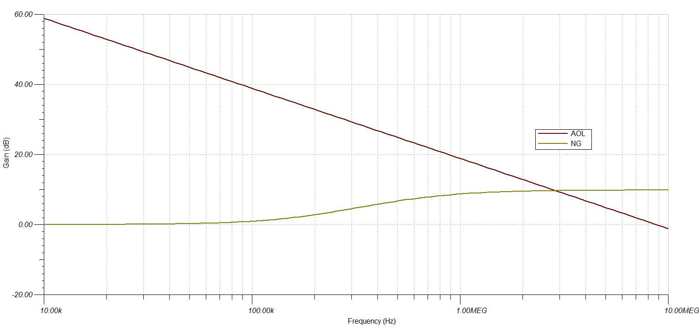

# SIMPLE PHOTODIODE DETECTOR CIRCUIT
I was inspired by a DET110 from Thorlabs that I've previously used in a university lab to build a miniature version of such a useful detector.
## Theory of operation
A simple photodiode detector is based around a reverse biased photodiode connected to a load resistor. The load resistor sets the output voltage of the circuit. 

This is how a simplified circuit of a photodetector looks like:
[imagine photodetector thorlabs]
 
  

    
     
     
    <a><b>Stability analysis, frequency response</b></a>

 

The low pass filtering of the input or battery voltage can be safely ignored when analysing the circuit for bandwidth and rise time limitations, as such the equivalent circuit for the detector looks like this:
[circuit echivalent detector]
 
  

    
     
     
    <a><b>Stability analysis, frequency response</b></a>

 

The transfer function of the circuit will be $T(s)=\frac{R_{L}}{1+s\cdot R_{L}\\;C_{D}}$, with CD being the diode capacitance for a given reverse bias voltage (VR). From this simple first order transfer function we may derive the following useful parameters:
- tr or rise time: $BW=\frac{1}{2\pi\cdot R_{L}\\;C_{D}}$
- BW or Bandwidth: $t_{r}=\frac{0.35}{BW}=2.2\cdot R_{L}\\;C_{D}$

  As we can see the bandwidth is limited by both $C_{D}$ and $R_{L}$. Higher load resistance will yield higher output voltage, but will lead to lower overall VR and a decrease in bandwidth.

Being reverse biased, the photodiode will have a dark current, dependant on the reverse voltage of the diode. For large reverse voltages (above $4\cdot V_{T}$), the dark current will closely match the saturation current of the photodiode. 

## Building a miniature photodetector 
A small photodector with voltage rail filtering is built around the IR photodiode PD15-22B-TR8, a small Si PIN photodiode with low capacitance and small form factor. The circuit is designed to be used on a solderless breadboard, in conjunction with an infrared emitter.
The small smd photodiode is soldered, for conveniance, on a 2.5mm header.

This is the circuit schematic:

 
  

    
     
     
    <a><b>Stability analysis, frequency response</b></a>

 

This is the built circuit on a protoboard:

 
  

    
     
     
    <a><b>Stability analysis, frequency response</b></a>

 

## Performance of the photodetector circuit

