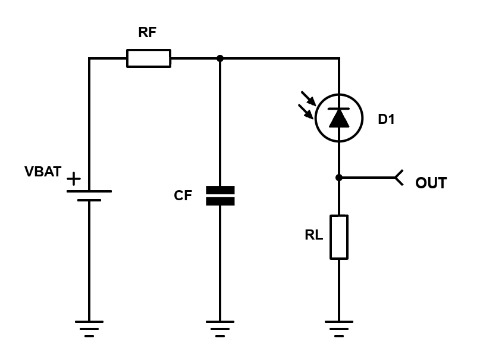

# SIMPLE PHOTODIODE DETECTOR CIRCUIT
I was inspired by a DET110 from Thorlabs that I've previously used in a university lab to build a miniature version of such a useful detector.
## Theory of operation
A simple photodiode detector is based around a reverse biased photodiode connected to a load resistor. The load resistor sets the output voltage of the circuit. 

This is how a simplified circuit of a photodetector looks like:
 
  

    
     
     
    <a><b>Simple photodetector with resistive load, with supply voltage filtering</b></a>

 

The low pass filtering of the input or battery voltage can be safely ignored when analysing the circuit for bandwidth and rise time limitations, as such the equivalent circuit for the detector looks like this:
 
  

    
     
     
    <a><b>Equivalent circuit of photodetector, with internal capacitance of photodiode depicted</b></a>

 

The transfer function of the circuit will be $T(s)=\frac{R_{L}}{1+s\cdot R_{L}\\;C_{D}}$, with CD being the diode capacitance for a given reverse bias voltage (VR). From this simple first order transfer function we may derive the following useful parameters:
- tr or rise time: $BW=\frac{1}{2\pi\cdot R_{L}\\;C_{D}}$
- BW or Bandwidth: $t_{r}=\frac{0.35}{BW}=2.2\cdot R_{L}\\;C_{D}$

Formulas for both BW and tr are derived on <a href="https://en.wikipedia.org/wiki/Rise_time#:~:text=One%2Dstage%20low%2Dpass%20RC%20network%5Bedit%5D">this</a> wikipedia page. 

As we can see, the bandwidth is limited by both $C_{D}$ and $R_{L}$. Higher load resistance will yield higher output voltage, but will lead to lower overall VR and a decrease in bandwidth. An optional capacitor may be added in parallel to the load resistor to further constrain the bandwidth of the system.

Being reverse biased, the photodiode will have a dark current, dependant on the reverse voltage of the diode. For large reverse voltages (above $4\cdot V_{T}$), the dark current will closely match the saturation current of the photodiode. 

## Building a miniature photodetector 
A small photodetector with voltage rail filtering is built around the IR photodiode PD15-22B-TR8, a small Si PIN photodiode with low capacitance and small form factor. The circuit is designed to be used on a solderless breadboard, in conjunction with an infrared emitter.
The small smd photodiode is soldered, for conveniance, on a 2.5mm header.

This is the circuit schematic:

 
  

    
     
     

 

This is the built circuit on a protoboard:

 
  

    
     
     

 

## Performance of the photodetector circuit
We are interested in how the output voltage depends upon:
- Frequency of incident light
- Output power of light source

For testing the frequency response of the photodetector, we need only to pulse an IR LED at various predetermined frequencies and note the frequency at which the rise time is 35% of the wave's period. For these measurements, the distance between the source and detector must be maintained constant. 

The led pulser is built around a simple base-voltage-referenced current source, controlled by a signal generator. The signal generator's maximum swing is 2.5V, thus we require a small control resistor. A 220 $\Omega$ to 470 $\Omega$ resistor will ensure sufficient current flow to both transistors of the pulser. LED current will be $I_{LED}=\frac{V_{BE}}{R_{SET}}$, when Q2 is supplied by a positive voltage and $I_{LED}=0$ for all other cases.

 
  

    
     
     
    <a><b>IRLED pulser for frequency response testing </b></a>

 

The collected measurements are presented in a plot below:

 
  

    
     
     
    <a><b>Frequency response plot of photodetector</b></a>

 

The Bandwidth graphically determined from the above plot is BW = ? kHz.

Varying the optical output power, whilst maintainting constant distance is not really possible with my equipment right now. As a general rule of thumb the sensing range of the small photodiode I used will be restricted to at most 10-15cm. This range may be extended or reduced depending on light source's optical power.

