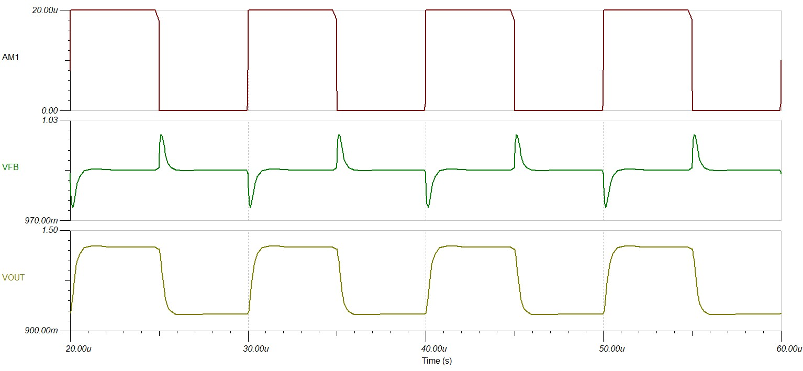

# DESIGN AND IMPLEMENTATION OF A PROPER PHOTODIODE TRANSIMPEDANCE AMPLIFIER
## Introduction
I wanted to build a proper photodiode transimpedance amplifier capable of working with infrared light pulses at frequencies slighlty above 100kHz.

A regular transimpedance amplifier or transresistance amplifier employs only a resistor in the feedback path of the op amp. Bandwidth limitations are dictated directly by the input capacitance of the circuit, i.e. the capacitance of the photodiode and that of the op-amp input stage.
An important distinction to make going forward with this projects is that what I've implemented is valid only for constant GBW product op-amps and does not apply to non-unity gain stable or decompensated op-amps.

A regular non-compensated transimpedance amplifier looks like this:


<br>
  <p align="center">
    
    <br>
    <br>
    <a><b>Not compensated Transimpedance Amplifier</b></a>
</p>
<br>

The amplifier presents a second order transfer function, that can be found derived <a href="https://www.planetanalog.com/seemingly-simple-circuits-transresistance-amplifier-part-1-approximating-op-amps/">here</a>. Of more interest to us, at least from the view point of stability analysis, are **$A_{OL}$** and **$\frac{1}{\beta}$**. We need this functions to determine the Rate of Closure of the two curves, meaning the difference between the slopes of the open loop gain and $\frac{1}{\beta}$. A ROC below or equal to 20dB/decade is considered the caharcateristic of a stable system, alternatively the ROC can be used to estimate the phase margin.

As such we have for the non-compensated TIA the folllowing formulas:
$A_{OL}=\frac{A_{DC}}{1+\frac{s}{w_{A}}}$
$\frac{1}{\beta}=(1+s\cdot R_{F} C_{I})$
They approximatively intersect at $f_{I}=\frac{1}{2\cdot\pi}\cdot \sqrt{\frac{2\pi\cdot GBP}{R_{F}\cdot C_{I}}}$, where GBP is the Gain-Bandwidth Product of the used op-amp.

A proper derivation of this formulas would better account for the signs of the different functions, but for our ROC plot needs, those are irelevant, as we ignore phase in our analysis.

Below is presented the test circuit used to determine $A_{OL}$ and $\frac{1}{\beta}$. The test circuit could be bettered by adding a copy of the circuit as a dummy load, to better represent the actual loading at the nodes of the op-amp.

<br>
  <p align="center">
    
    <br>
    <br>
    <a><b>Stability analysis test-circuit</b></a>
</p>
<br>

Plotting the required functions, we observe in the plot made available below that the ROC is approximatively 40dB/dec.

<br>
  <p align="center">
    
    <br>
    <br>
    <a><b>Bode plot for ROC-analysis</b></a>
</p>
<br>

The explanation for this is simple, the dominant-pole model of the op-amp ensures a -20dB/dec descending slope, whilst $\frac{1}{\beta}$ presents a single zero and a +20dB/dec ascending slope.

This circuit is not stable, ringing will be present at even moderate frequencies.

For such circuits, the size of the feedback resistor is quite important. A TIA with a very big feedback resistor, think on the order of 1 $M\Omega$ to 10s $G\Omega$, need exceedingly smaller compensation capacitors, sometimes only the parasitics of the PCB might suffice. However, any stray or intended capacitance across the feedback resistor will reduce the bandwidth of the TIA, so some attention is required on the layout side of things.

## The solution to our woes...
Comes from adding a carefully selected feedback capacitor across the feedback resistor.

This is the equivalent circuit of a TIA with input and photodiode capacitances depicted.

<br>
  <p align="center">
    
    <br>
    <br>
    <a><b>TIA with input capacitances</b></a>
</p>
<br>

The input capacitance is defined as $C_{I}=C_{D}+C_{CM}+C_{DIFF}$, where $C_{D}$ is the junction capacitance of the photodiode, and the other two terms are the parasitic capacitances of the input impedance of the op-amp.

A simple stability analysis is quite straightforward, the same as for the non-compensated transresistance amplifier, with the mention that addition of $C_{F}$ introduces a pole in expression of $\frac{1}{\beta}$. For us, $\frac{1}{\beta}=\frac{1+s\cdot R_{F}(C_{F}+C_{I})}{1+s\cdot R_{F}C_{F}}$, as depicted below:
The introduction of a pole cancels out the positive slope imparted by the zero and stability is achieved.

A fist step towards building a working circuit is determining the maximum feedback cap value, such that the frequency of the pole of $\frac{1}{beta}$ is smaller or equal to the desired bandwidth of the TIA. The idea behind this is that beyond the pole frequenct the overall transfer function of the circuit will decrease rapidly.

$$C_{F}\leq \frac{1}{2\pi\cdot R_{F}\cdot f_{-3dB}}$$

The next step would be to determine the minimum GBP of an op-amp that could be used for our application.

However, I've taken a different approach.

## Q-based design procedure
This is based on the presentation "Simple Transimpedance Designs Using High Speed Op Amps" by Steffens and Ramus.
After long work the gentlemen from TI obtain the following transfer function characterizing the workings of the TIA:

<br>
  <p align="center">
    
    <br>
    <br>
    <a><b>Not compensated Transimpedance Amplifier</b></a>
</p>
<br>

A regular second order transfer function is of the form $G(s)=G_{0}*\frac{w_{o}^{2}}{s^{2}+s\cdot\frac{wo}{Q}+w_{o}^{2}}$. If you are familiar with the other notation convention, $\zeta$ is in this case is $\frac{1}{2\cdot Q}$, and $C_{S}$ is the same as $C_{S}$

<br>
  <p align="center">
    
    <br>
    <br>
</p>
<br>

<br>
  <p align="center">
    
    <br>
    <br>
</p>
<br>

Of interest to us is the equality $Q = \frac{F_{o}}{F_{c}}=\frac{P_{1}}{F_{o}}$

$$\begin{align}
Q\cdot F_{o}=P_{1}\\
\\
Q\cdot \sqrt{Z_{1}\cdot GBP}=P_{1}\\
\\
Q^{2}\cdot Z_{1}\cdot GBP=P_{1}^{2}\\
\\
Q^{2}\cdot GBP \cdot \frac{1}{C_{F}+C_{S}}=\frac{1}{2\pi\cdot R_{F}C_{F}^{2}}\\
\\
\end{align}$$

In the end we obtain the following quadratic equation: 
$$2\pi\cdot Q^{2}\cdot GBP\cdot R_{F}\cdot C_{F}^{2}-C_{F}-C_{S}=0$$

The equation has two solutions , only one will be valid, and that is simple to prove. There are two ways to go about this. The first one assumes that the capacitance of the photodiode is at least 10x times bigger than the feedback cap, as such we neglect the term $C_{F}$ from the equation $2\pi\cdot Q^{2}\cdot GBP\cdot R_{F}\cdot C_{F}^{2}-C_{F}-C_{S}=0$ and obtain $2\pi\cdot Q^{2}\cdot GBP\cdot R_{F}\cdot C_{F}^{2}=C_{S}$.
Approximated as such, the solutions for $C_{F}$ are $\pm\sqrt{\frac{C_{S}}{2\pi\cdot Q^{2}\cdot GBP\cdot R_{F}}}$. One of them is obviously negative, so we have the solution $C_{F}=\frac{1}{Q}\cdot\sqrt{\frac{C_{S}}{2\pi\cdot GBP\cdot R_{F}}}$.

This approximation (or similar) ones only work with gigantic photodiodes, for photodiodes with capacitances closer to the feedback values we need a different approach:


$$\begin{align}
C_{F1,2}=\frac{1\pm\sqrt{1+8\cdot\pi\cdot Q^{2}\cdot GBP\cdot R_{F}\cdot C_{S}}}{4\cdot\pi\cdot Q^{2}\cdot GBP\cdot R_{F}}\\
\\
1\gtrless \sqrt{1+8\cdot\pi\cdot Q^{2}\cdot GBP\cdot R_{F}\cdot C_{S}}\quad \| (...)^{2}\\
\\
1\gtrless 1+8\cdot\pi\cdot Q^{2}\cdot GBP\cdot R_{F}\cdot C_{S}\\
\\
\end{align}$$

For regular parameter values, 1 will be indeed smaller than $1+8\cdot\pi\cdot Q^{2}\cdot GBP\cdot R_{F}\cdot C_{S}$. We can approximate this as $C_{F}=\frac{1}{Q}\cdot\sqrt{\frac{C_{S}}{2\cdot GBP\cdot R_{F}}}$

These are not the best approximations, but can provide at least a rough estimate. It's best to use it in full form, with all the 1's still present.

The transfer function of the circuit follows the form of a second order Low Pass filter with a certain Q or $\zeta$. We need to select a Q such that the system is either critically dampened or overdampened, we do not want excessive ringing, nor do we want to slow of a rise time.

Besides the natural rise time of the system we need to take into account that the settkling time figure provided for the op-amp also includes the "dead-time". So this parameters impose a certain penalty on the maximum frequency the circuit can process.

## Implementing all this theory
We have the following requirements:

| Parameter           | Value  | Unit    |
|---------------------|--------|---------|
| $f_{max}$           | 100    | kHz     |
| $BW$                | 300    | kHz     |
| $I_{SC}$ @ 1mW/cm^2 | 50     | $\mu A$ |
| $V_{O(max)}$        | 1      | V       |
| $C_{D}$ @ VR = 0V   | 15     | pF      |

The parameters have the following meanings:
-  $f_{max}$ is the maximum frequency where the wavefrom should have no significant distortion
-   $I_{SC}$ is the shortcircuit current of the photodiode QSD2030F from ONSEMI
-   $V_{O(max)}$ is the maximum output voltage swing
-   $C_{D}$ is the photodiode capacitance

After carefully reading <a href="https://www.ti.com/lit/ug/tidu535/tidu535.pdf?ts=1700568749373&ref_url=https%253A%252F%252Fwww.ti.com%252F">this</a> 1 MHz, Single-Supply, Photodiode Amplifier Reference Design, I selected an op-amp with low input bias/input offset current and with a large GBP.

These are the most relevant specs of the op-amp I selected, the OPA2374:
| Parameter      | Value   | Unit |
|----------------|---------|------|
| GBP            | 6.5     | MHz  |
| $A_{OL}$*      | 110     | dB   |
| $I_{B}/I_{OS}$ | $\pm$ 10| pA   |
| $V_{OS}$       | 5       | mV   |
| $C_{DIFF}$     | 3       | pF   |
| $C_{CM}$       | 6       | pF   |

*Note that $A_{OL}$ is measured with V+ = VS/2, G=+1 and RL = 1kOhm

I set Q to 1 for two reasons:
-  PM $\approx$ 50/Q
-  Q = 1 greatly simplifies some formulas

For Q = 1 we will have a PM of at least 50deg, enough to pass the recommended threshold of 45deg.

This cute little snippet of code was used to determine the proper values of $CF$

```python
#OP-AMP SPECS

GBP = 6.5e+6
ADC = 10 ** (110/20)
BW = 300e+3
Isc = 50e-6
VOmax = 1
CJD = 15e-12
CI = 10e-12

RF = VOmax / Isc
RF

Q = 1

#CF optimum value
CF = (1 + np.sqrt(1 + 8 * Q * np.pi * GBP * RF * (CJD + CI))) / (2 * Q * np.pi * GBP * RF)
print(np.round(CF/1e-12,2), "pF")

#Distance from pole to crossing
dist = (RF * CF ** 2 * GBP * 2 * np.pi) / (CJD + CI + CF)
print(np.round(dist,2))
```
The results are as follows: $C_{F}$ = 12.36pF and dist = 3.34. The parameter needs an explanation, dist is the ratio between $F_{I}$ (the intersection between $\frac{1}{\beta}$ and $A_{OL})$ and the pole frequency of $\frac{1}{\beta}$, P1 by the TI notation. If dist is 1, this means P1 is equal to $F_{I}$, this being quite a precarious situation, because changes in op-amp gain or feedback capacitor tolerance will push around the plots until the intersection of the two will have a not so great ROC. $F_{I}$ is also the value of the minimum GBP needed for the circuit to function as intended.

## Simulations
Simulations were necessary to ensure:
-  Stability
-  Transimpedance
-  Transient behaviour

### STABILITY SIMULATION
[schema si plot stab]
<br>
  <p align="center">
    
    <br>
    <br>
</p>
<br>


<br>
  <p align="center">
    
    <br>
    <br>
</p>
<br>


### TRANSIMPEDANCE SIMULATION
[schema si plot IVGain]
<br>
  <p align="center">
    
    <br>
    <br>
</p>
<br>


<br>
  <p align="center">
    
    <br>
    <br>
</p>
<br>

### TRANSIENT BEHAVIOUR
[Schema si plot trans]
<br>
  <p align="center">
    
    <br>
    <br>
</p>
<br>


<br>
  <p align="center">
    
    <br>
    <br>
</p>
<br>

## Built prototype
Pending arrival of necessary components.

## Bibliograpy
- https://www.planetanalog.com/seemingly-simple-circuits-transresistance-amplifier-part-1-approximating-op-amps/
- https://www.planetanalog.com/stability-issues-for-high-speed-amplifiers-introductory-background-and-improved-analysis-insight-5/
- https://www.ti.com/lit/ug/tidu535/tidu535.pdf?ts=1700568749373&ref_url=https%253A%252F%252Fwww.ti.com%252F
- https://www.ti.com/lit/an/sboa521/sboa521.pdf?ts=1707922004187&ref_url=https%253A%252F%252Fwww.google.com%252F
- https://www.planetanalog.com/understand-and-apply-the-transimpedance-amplifier-part-1-of-2/
- https://2n3904blog.com/trans-impedance-amplifier-transfer-function/
- Transimpedance Amplifiers: What Op Amp Bandwidth do I Need? by John Caldwell
